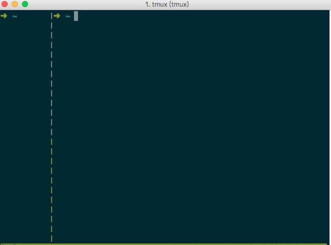

## 让你的 tmux 支持用鼠标拖动各屏的大小
　　tmux的威力就不说了，它已成服务端开发人员，或者像我这种不是服务开发却喜欢装B的人士的必备。算起来，使用tmux已经快2年了，只是不是专业的服务端开发人员，所以使用的程度不重，只是偶尔在自己的服务器上用用。最近有好几个月没有使用它了，好多操作都不熟悉了，今天突然想在`tmux`上的开`vim`，要想让`vim`的窗口大，剩下的一屏小一点，只是让它执行`终端编译命令`。但`tmux`默认配置只会均匀地分割，在网上找遍了资料就是不行，总均匀地给你分屏。  
　　搜索了很多资源，网上的资源大多是这样的：
　　
```
setw -g mouse-resize-pane on
setw -g mouse-select-pane on
setw -g mouse-select-window on
setw -g mode-mouse on
```  
　　但是非常遗憾，上面的这个配置在我的2.2版的tmux就是不生效。后面在`Stack Overflow`找到解决，原因是我们的版本过高，不支持之前的配置了，正确的配置只需要一行就OK了。
　　
```
set-option -g mouse on
```  
　　在`~/.tmux.conf`中增加如上面的一行，然后进入tmux后，按`C + b :`输入`source ~/.tmux.conf`，重启tmux,完美！
　　
　　
　　可以直接用鼠标拖动分屏的大小了，这个可方便了。
　　
　　


